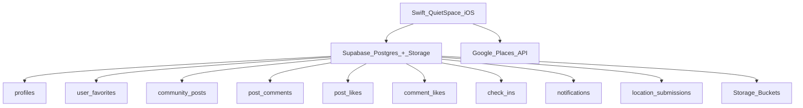

# QuietSpace Database Instructions (Swift / iOS)

This guide explains how to use the database and external APIs from the **Swift-QuietSpace** iOS app. All data lives in a shared **Supabase** project (the same one used by the React Native app) plus **Google Places/Maps** for place data.

---

## Architecture Overview



**Key files in the Swift project:**

| File | Purpose |
|------|---------|
| `Helpers/AppConfig.swift` | API keys and configuration |
| `Managers/SupabaseService.swift` | All Supabase database operations |
| `Managers/GooglePlacesService.swift` | All Google Places API calls |
| `Models/UserProfile.swift` | `profiles` table model |
| `Models/FavoritePlace.swift` | `user_favorites` table model |
| `Models/CommunityPost.swift` | `community_posts` table model |
| `Models/PostComment.swift` | `post_comments` table model |
| `Models/PostLike.swift` | `post_likes` / `comment_likes` models |
| `Models/CheckIn.swift` | `check_ins` table model |
| `Models/AppNotification.swift` | `notifications` table model |
| `Models/LocationSubmission.swift` | `location_submissions` table model |
| `Models/Place.swift` | Shared Place/TransitStop models + PlaceHelpers |

---

## 1. Configuration

All keys are in `AppConfig.swift`. They match the React Native app so both platforms share the same backend.

```swift
AppConfig.supabaseURL         // Supabase project URL
AppConfig.supabaseAnonKey     // Supabase anon/public key
AppConfig.googlePlacesAPIKey  // Google Places API key
```

You do **not** need to create a new Supabase project or new Google credentials. Everything is already set up.

---

## 2. Supabase Service (`SupabaseService.shared`)

Every database call goes through `SupabaseService.shared`. All methods are `async throws`.

### 2.1 Authentication

```swift
// Sign up a new user
let result = try await SupabaseService.shared.signUp(
    email: "user@example.com",
    password: "securePassword123",
    fullName: "Jane Doe"
)
// result.user?.id  → the new user's ID
// result.access_token → JWT for authenticated requests

// Sign in an existing user
let result = try await SupabaseService.shared.signIn(
    email: "user@example.com",
    password: "securePassword123"
)

// Sign out
SupabaseService.shared.signOut()
```

After `signIn` or `signUp`, the service stores the access token internally. All subsequent calls are authenticated.

### 2.2 User Profiles

**Table: `profiles`**

| Column | Type | Notes |
|--------|------|-------|
| `id` | uuid (PK) | matches auth user id |
| `email` | text | |
| `full_name` | text | |
| `avatar_url` | text | public URL |
| `role` | text | `user`, `admin`, or `banned` |
| `is_admin` | bool | legacy flag |
| `created_at` | timestamp | |

```swift
// Fetch a user's profile
let profile = try await SupabaseService.shared.getUserProfile(userId: "uuid-string")
print(profile?.displayName)  // "Jane Doe"
print(profile?.displayRole)  // "user" or "admin"

// Update profile
try await SupabaseService.shared.updateUserProfile(
    userId: "uuid-string",
    fullName: "Jane Smith",
    avatarUrl: "https://..."
)

// Check if user is admin
let admin = try await SupabaseService.shared.isAdmin(userId: "uuid-string")

// Get all users (admin)
let users = try await SupabaseService.shared.getAllUsers()

// Ban / unban user (admin)
try await SupabaseService.shared.banUser(userId: "uuid-string")
try await SupabaseService.shared.unbanUser(userId: "uuid-string")
```

### 2.3 Favorites

**Table: `user_favorites`**

| Column | Type | Notes |
|--------|------|-------|
| `id` | int (PK) | auto-generated |
| `user_id` | uuid | FK → profiles |
| `google_place_id` | text | from Google Places |
| `name` | text | snapshot of place name |
| `address` | text | |
| `rating` | float | |
| `user_ratings_total` | int | |
| `latitude` / `longitude` | float | |
| `place_type` | text | library, park, cafe, etc. |
| `quiet_score` | float | |
| `photo_reference` | text | Google photo ref |
| `created_at` | timestamp | |

```swift
// Fetch all favorites for a user
let favorites = try await SupabaseService.shared.getFavorites(userId: userId)
// Each FavoritePlace can be converted to a Place:
let places = favorites.map { $0.toPlace() }

// Add a place to favorites
try await SupabaseService.shared.addFavorite(userId: userId, place: somePlace)

// Remove a favorite
try await SupabaseService.shared.removeFavorite(
    userId: userId,
    googlePlaceId: "ChIJ..."
)

// Check if a place is already favorited
let isFav = try await SupabaseService.shared.isFavorite(
    userId: userId,
    googlePlaceId: "ChIJ..."
)
```

### 2.4 Community Posts

**Table: `community_posts`**

| Column | Type | Notes |
|--------|------|-------|
| `id` | int (PK) | |
| `user_id` | uuid | FK → profiles |
| `user_name` | text | denormalized |
| `user_avatar_url` | text | |
| `place_name` | text | |
| `image_url` | text | |
| `caption` | text | |
| `category` | text | |
| `likes_count` | int | |
| `comments_count` | int | |
| `status` | text | `pending`, `approved`, `rejected` |
| `created_at` | bigint | epoch ms |

```swift
// Fetch approved posts
let posts = try await SupabaseService.shared.getCommunityPosts(limit: 20)

// Create a new post
let insert = CommunityPostInsert(
    userId: userId,
    userName: "Jane",
    userAvatarUrl: nil,
    placeName: "Central Library",
    imageUrl: imageUrl,
    caption: "So quiet here!",
    category: "Libraries",
    likesCount: 0,
    commentsCount: 0,
    createdAt: Int64(Date().timeIntervalSince1970 * 1000)
)
let newPost = try await SupabaseService.shared.createCommunityPost(insert)

// Admin: fetch pending posts
let pending = try await SupabaseService.shared.getPendingPosts()

// Admin: approve or reject
try await SupabaseService.shared.updatePostStatus(postId: 42, status: "approved")

// Delete a post
try await SupabaseService.shared.deletePost(postId: 42)
```

### 2.5 Likes (Posts and Comments)

**Tables: `post_likes`, `comment_likes`**

```swift
// Toggle like on a post (adds if not liked, removes if already liked)
let (isLiked, count) = try await SupabaseService.shared.toggleLike(
    postId: 42,
    userId: userId
)
// isLiked = true means the post is now liked
// count = updated total likes

// Check if a specific post is liked
let liked = try await SupabaseService.shared.isPostLiked(postId: 42, userId: userId)

// Get all post IDs the user has liked
let likedIds = try await SupabaseService.shared.getUserLikedPosts(userId: userId)

// Toggle like on a comment
let (isCommentLiked, commentLikeCount) = try await SupabaseService.shared.toggleCommentLike(
    commentId: 7,
    userId: userId
)

// Get all comment IDs the user has liked
let likedCommentIds = try await SupabaseService.shared.getUserLikedComments(userId: userId)
```

### 2.6 Comments and Replies

**Table: `post_comments`**

| Column | Type | Notes |
|--------|------|-------|
| `id` | int (PK) | |
| `post_id` | int | FK → community_posts |
| `user_id` | uuid | FK → profiles |
| `user_name` | text | |
| `user_avatar_url` | text | |
| `comment` | text | |
| `rating` | int | |
| `likes_count` | int | |
| `parent_comment_id` | int | null for top-level, FK → post_comments for replies |
| `created_at` | bigint | |

```swift
// Fetch all comments for a post
let comments = try await SupabaseService.shared.getComments(postId: 42)

// Add a comment
let commentInsert = PostCommentInsert(
    postId: 42,
    userId: userId,
    userName: "Jane",
    userAvatarUrl: nil,
    comment: "Love this place!",
    rating: 0,
    createdAt: Int64(Date().timeIntervalSince1970 * 1000)
)
let newComment = try await SupabaseService.shared.addComment(commentInsert)

// Reply to a comment
let replyInsert = ReplyInsert(
    postId: 42,
    parentCommentId: 7,
    userId: userId,
    userName: "Jane",
    userAvatarUrl: nil,
    comment: "Thanks!",
    createdAt: Int64(Date().timeIntervalSince1970 * 1000)
)
let reply = try await SupabaseService.shared.addReply(parentCommentId: 7, reply: replyInsert)

// Delete a comment
try await SupabaseService.shared.deleteComment(commentId: 7)
```

### 2.7 Check-ins

**Table: `check_ins`**

| Column | Type | Notes |
|--------|------|-------|
| `id` | int (PK) | |
| `user_id` | uuid | FK → profiles |
| `user_name` | text | |
| `place_id` | text | Google place_id |
| `place_name` | text | |
| `place_type` | text | |
| `latitude` / `longitude` | float | |
| `noise_level` | text | |
| `busyness` | text | |
| `wifi_quality` | text | |
| `outlets` | text | |
| `note` | text | |
| `created_at` | timestamp | ISO 8601 |

```swift
// Create a check-in
let checkIn = CheckInInsert(
    userId: userId,
    userName: "Jane",
    placeId: "ChIJ...",
    placeName: "Central Library",
    placeType: "library",
    latitude: 43.6532,
    longitude: -79.3832,
    noiseLevel: "quiet",
    busyness: "moderate",
    wifiQuality: "good",
    outlets: "plenty",
    note: "3rd floor is the quietest",
    createdAt: ISO8601DateFormatter().string(from: Date())
)
let created = try await SupabaseService.shared.createCheckIn(checkIn)

// Fetch check-ins for a place
let placeCheckIns = try await SupabaseService.shared.getCheckInsForPlace(placeId: "ChIJ...")

// Fetch a user's check-in history
let myCheckIns = try await SupabaseService.shared.getUserCheckIns(userId: userId)
```

### 2.8 Notifications

**Table: `notifications`**

| Column | Type | Notes |
|--------|------|-------|
| `id` | int (PK) | |
| `user_id` | uuid | FK → profiles |
| `type` | text | `post_like`, `comment`, `reply`, `comment_like` |
| `title` | text | |
| `message` | text | |
| `metadata` | json | extra IDs |
| `is_read` | bool | |
| `created_at` | timestamp | |

```swift
// Fetch notifications
let notifications = try await SupabaseService.shared.getNotifications(userId: userId)

// Mark one as read
try await SupabaseService.shared.markNotificationAsRead(notificationId: 5)

// Mark all as read
try await SupabaseService.shared.markAllNotificationsAsRead(userId: userId)

// Get unread count
let unread = try await SupabaseService.shared.getUnreadNotificationCount(userId: userId)

// Delete a notification
try await SupabaseService.shared.deleteNotification(notificationId: 5)
```

### 2.9 Location Submissions (Admin)

**Table: `location_submissions`**

| Column | Type | Notes |
|--------|------|-------|
| `id` | int (PK) | |
| `user_id` | uuid | FK → profiles |
| `name` | text | |
| `address` | text | |
| `type` | text | |
| `description` | text | |
| `latitude` / `longitude` | float | |
| `quiet_score` | float | |
| `image_url` | text | |
| `status` | text | `pending`, `approved`, `rejected` |
| `admin_notes` | text | |
| `created_at` | timestamp | |

```swift
// Submit a new location
let sub = LocationSubmissionInsert(
    userId: userId,
    name: "Hidden Garden",
    address: "789 Oak St",
    type: "garden",
    description: "A peaceful community garden",
    latitude: 43.6600,
    longitude: -79.3900,
    quietScore: 4.5,
    imageUrl: nil,
    status: "pending"
)
let submission = try await SupabaseService.shared.createLocationSubmission(sub)

// Admin: fetch pending submissions
let pending = try await SupabaseService.shared.getLocationSubmissions(status: "pending")

// Admin: approve
try await SupabaseService.shared.updateLocationSubmissionStatus(
    id: 10,
    status: "approved",
    adminNotes: "Verified location"
)

// Fetch approved submissions (for map display)
let approved = try await SupabaseService.shared.getApprovedSubmissions()
let mapPlaces = approved.map { $0.toPlace() }
```

### 2.10 File Uploads (Storage Buckets)

Three storage buckets are available:

| Bucket | Purpose |
|--------|---------|
| `avatars` | Profile pictures |
| `community-posts` | Post images |
| `location-submissions` | Submission photos |

```swift
// Upload a profile avatar
if let imageData = uiImage.jpegData(compressionQuality: 0.8) {
    let publicURL = try await SupabaseService.shared.uploadAvatar(
        imageData: imageData,
        userId: userId
    )
    // Then update the profile with the new URL
    try await SupabaseService.shared.updateUserProfile(
        userId: userId,
        fullName: nil,
        avatarUrl: publicURL
    )
}

// Upload a post image
let postImageURL = try await SupabaseService.shared.uploadPostImage(
    imageData: imageData,
    userId: userId
)

// Upload a location submission image
let locationImageURL = try await SupabaseService.shared.uploadLocationImage(
    imageData: imageData,
    userId: userId
)
```

---

## 3. Google Places Service (`GooglePlacesService.shared`)

All Google Places calls go through `GooglePlacesService.shared`. All methods are `async throws`.

### 3.1 Nearby Search

Find quiet places around a location.

```swift
let places = try await GooglePlacesService.shared.searchNearby(
    latitude: 43.6532,
    longitude: -79.3832,
    radius: 5000,         // meters
    type: "library"       // or nil for all types
)
// Returns [Place] sorted by distance
```

### 3.2 Text Search

Free-text search tied to a location.

```swift
let results = try await GooglePlacesService.shared.searchByText(
    query: "quiet coffee shop",
    latitude: 43.6532,
    longitude: -79.3832
)
```

### 3.3 Autocomplete

Type-ahead suggestions while the user types in a search bar.

```swift
let predictions = try await GooglePlacesService.shared.autocomplete(
    query: "cent",
    latitude: 43.6532,
    longitude: -79.3832
)
for p in predictions {
    print(p.mainText)       // "Central Library"
    print(p.secondaryText)  // "123 Main St, Toronto"
    print(p.placeId)        // "ChIJ..."
}
```

### 3.4 Place Details

Full info for a single place (phone, website, hours, reviews).

```swift
let detail = try await GooglePlacesService.shared.getPlaceDetails(placeId: "ChIJ...")
print(detail?.phoneNumber)
print(detail?.website)
print(detail?.openingHours)    // ["Monday: 9:00 AM - 9:00 PM", ...]
print(detail?.reviews?.count)
```

### 3.5 Photo URL

Build a URL for a place photo. Use it in `AsyncImage` or similar.

```swift
if let ref = place.photoReference,
   let url = GooglePlacesService.shared.photoURL(reference: ref, maxWidth: 400) {
    AsyncImage(url: url) { image in
        image.resizable()
    } placeholder: {
        ProgressView()
    }
}
```

### 3.6 Transit Stops

Find nearby subway, bus, and streetcar stops.

```swift
let stops = try await GooglePlacesService.shared.searchTransitStops(
    latitude: 43.6532,
    longitude: -79.3832,
    radius: 2000
)
for stop in stops {
    print(stop.name)         // "Queen Station"
    print(stop.transitType)  // "subway", "bus", or "streetcar"
    print(stop.distance)     // "350m"
}
```

---

## 4. How Data Flows Between Google and Supabase

Google Places is a **read-only external source**. Data only gets saved to Supabase when the user takes an action:

| User Action | What Gets Stored | Where |
|-------------|-----------------|-------|
| Favorites a place | Snapshot of name, address, rating, location, `google_place_id` | `user_favorites` |
| Checks in | `place_id`, name, type, location + noise/wifi/busyness feedback | `check_ins` |
| Searches or browses | Nothing | Only in memory / local cache |

So the pattern is:

1. **Search** via `GooglePlacesService` → get `[Place]`
2. **Display** to user
3. **User acts** (favorite, check-in) → call `SupabaseService` to persist

---

## 5. Using the Services in ViewModels

Here is a typical pattern for wiring the services into your SwiftUI view models:

```swift
class SearchViewModel: ObservableObject {
    @Published var places: [Place] = []
    @Published var isLoading = false

    func search(query: String, lat: Double, lng: Double) {
        isLoading = true
        Task {
            do {
                let results = try await GooglePlacesService.shared.searchByText(
                    query: query, latitude: lat, longitude: lng
                )
                await MainActor.run {
                    self.places = results
                    self.isLoading = false
                }
            } catch {
                print("Search error: \(error)")
                await MainActor.run { self.isLoading = false }
            }
        }
    }
}
```

```swift
class FavoritesViewModel: ObservableObject {
    @Published var favorites: [Place] = []
    @Published var isLoading = false

    func fetchFavorites(userId: String) {
        isLoading = true
        Task {
            do {
                let favs = try await SupabaseService.shared.getFavorites(userId: userId)
                await MainActor.run {
                    self.favorites = favs.map { $0.toPlace() }
                    self.isLoading = false
                }
            } catch {
                print("Favorites error: \(error)")
                await MainActor.run { self.isLoading = false }
            }
        }
    }

    func toggleFavorite(userId: String, place: Place) {
        Task {
            do {
                let isFav = try await SupabaseService.shared.isFavorite(
                    userId: userId,
                    googlePlaceId: place.googlePlaceId ?? place.id
                )
                if isFav {
                    try await SupabaseService.shared.removeFavorite(
                        userId: userId,
                        googlePlaceId: place.googlePlaceId ?? place.id
                    )
                } else {
                    try await SupabaseService.shared.addFavorite(userId: userId, place: place)
                }
                fetchFavorites(userId: userId)
            } catch {
                print("Toggle favorite error: \(error)")
            }
        }
    }
}
```

---

## 6. Error Handling

All service methods throw errors. Wrap calls in `do/catch`:

```swift
do {
    let posts = try await SupabaseService.shared.getCommunityPosts()
} catch {
    // error.localizedDescription contains the Supabase error message
    print("Failed to fetch posts: \(error.localizedDescription)")
}
```

Common error scenarios:

| Error | Cause | Fix |
|-------|-------|-----|
| 401 / 403 | Invalid or expired token | Re-authenticate with `signIn` |
| Column does not exist | Supabase schema missing a column | Add the column in Supabase dashboard |
| `REQUEST_DENIED` from Google | API key not enabled or restricted | Check Google Cloud Console |
| `OVER_QUERY_LIMIT` | Too many Google API calls | Add billing or reduce calls |

---

## 7. Quick Reference: All Available Methods

### SupabaseService.shared

| Category | Method | Returns |
|----------|--------|---------|
| **Auth** | `signUp(email:password:fullName:)` | `AuthResponse` |
| | `signIn(email:password:)` | `AuthResponse` |
| | `signOut()` | void |
| **Profiles** | `getUserProfile(userId:)` | `UserProfile?` |
| | `updateUserProfile(userId:fullName:avatarUrl:)` | void |
| | `isAdmin(userId:)` | `Bool` |
| | `getAllUsers()` | `[UserProfile]` |
| | `banUser(userId:)` / `unbanUser(userId:)` | void |
| **Favorites** | `getFavorites(userId:)` | `[FavoritePlace]` |
| | `addFavorite(userId:place:)` | void |
| | `removeFavorite(userId:googlePlaceId:)` | void |
| | `isFavorite(userId:googlePlaceId:)` | `Bool` |
| **Posts** | `getCommunityPosts(limit:)` | `[CommunityPost]` |
| | `createCommunityPost(_:)` | `CommunityPost?` |
| | `getPendingPosts()` | `[CommunityPost]` |
| | `updatePostStatus(postId:status:)` | void |
| | `deletePost(postId:)` | void |
| **Likes** | `toggleLike(postId:userId:)` | `(isLiked, likesCount)` |
| | `isPostLiked(postId:userId:)` | `Bool` |
| | `getUserLikedPosts(userId:)` | `[Int]` |
| | `toggleCommentLike(commentId:userId:)` | `(isLiked, likesCount)` |
| | `getUserLikedComments(userId:)` | `[Int]` |
| **Comments** | `getComments(postId:)` | `[PostComment]` |
| | `addComment(_:)` | `PostComment?` |
| | `addReply(parentCommentId:reply:)` | `PostComment?` |
| | `deleteComment(commentId:)` | void |
| **Check-ins** | `createCheckIn(_:)` | `CheckIn?` |
| | `getCheckInsForPlace(placeId:limit:)` | `[CheckIn]` |
| | `getUserCheckIns(userId:limit:)` | `[CheckIn]` |
| **Notifications** | `getNotifications(userId:limit:)` | `[AppNotification]` |
| | `markNotificationAsRead(notificationId:)` | void |
| | `markAllNotificationsAsRead(userId:)` | void |
| | `getUnreadNotificationCount(userId:)` | `Int` |
| | `deleteNotification(notificationId:)` | void |
| **Submissions** | `createLocationSubmission(_:)` | `LocationSubmission?` |
| | `getLocationSubmissions(status:)` | `[LocationSubmission]` |
| | `updateLocationSubmissionStatus(id:status:adminNotes:)` | void |
| | `getApprovedSubmissions()` | `[LocationSubmission]` |
| **Uploads** | `uploadAvatar(imageData:userId:)` | `String?` (URL) |
| | `uploadPostImage(imageData:userId:)` | `String?` (URL) |
| | `uploadLocationImage(imageData:userId:)` | `String?` (URL) |
| **Admin** | `deleteUserAccount(userId:)` | void |

### GooglePlacesService.shared

| Method | Returns |
|--------|---------|
| `searchNearby(latitude:longitude:radius:type:)` | `[Place]` |
| `searchByText(query:latitude:longitude:)` | `[Place]` |
| `autocomplete(query:latitude:longitude:)` | `[AutocompletePrediction]` |
| `getPlaceDetails(placeId:)` | `Place?` |
| `photoURL(reference:maxWidth:)` | `URL?` |
| `searchTransitStops(latitude:longitude:radius:)` | `[TransitStop]` |
